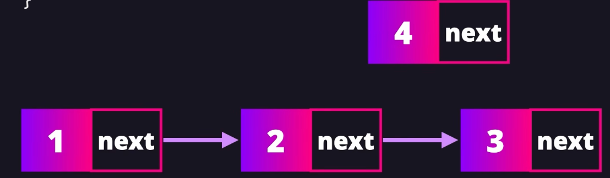

# 数据结构

- 单链表
```
class LinKedList {
    constructor(value){
        this.head = new Node(value);
    }
}
class Node {
    constructor(value, nextValue){
        this.value = value;
        this.next = next;
    }
}
```
1. 查找节点
    - 第一次查找：
 
第二次查找：

```
function findNode(value) {
    let currentNode = this.head
    while(currentNode !== value){
        currentNode = currentNode.next
    }
    if(!currentNode) return null
    return currentNode
}
```

2. 指定位置（后面）插入节点

插入成功

```
    <!-- 
    1. 创建新节点；2. 找到指定节点；
    3. 节点连接(把新节点的next与指定节点后面一个节点连接，然后把指定节点的next指向新节点) -->
    <!-- 1 2 3 4 insertAfter(2, 5) => 1 2 5 3 4-->
    function insertAfter(value newValue){
        let newNode = new Node(newValue);
        let currenNode = this.findNode(value);
        newNode.next = currenNode.next;
        currenNode.next = newNode;
    }
```

3. 在尾部插入节点

```
<!-- 1. 创建新节点；2. 循环遍历找到最后一个节点；3. 把新节点指向最后一个节点的next -->
 function append(value){
    let newNode = new Node(value);
    let currentNode = this.head;
    while(currentNode.next){
        currentNode = currentNode.next;
    }
    currentNode.next = newNode;
 }
```

4. 在头部插入节点


```
<!-- 1. 创建新节点；2. 把新节点的next指向头部head节点；3. 把head头部节点指向新节点 -->
function preAppend(value) {
    let newNode = new Node(value);
    let currentNode = this.head;
    newNode.next = currentNode
    currentNode = newNode
}
```

5. 删除指定节点
```
<!-- 找到要删除的节点以及该节点的前置节点 -->
function removeNode(value){
    let preNode = null;
    let currentNode = this.head;
    // 1. 循环找到value
    while(currentNode.value !== value){
        preNode = currentNode
        currentNode = currentNode.next
    }
    // 2. 判断是否为头节点，然后进行删除操作（指向被删除节点的下一个节点即可）
    if(currentNode === this.head){
        this.head = currentNode.next; // head指向后面的节点即可
    } else {
        preNode.next = currentNode.next;// 前置节点指向被删除节点的后置节点
    }
}
```

6. 删除头部节点
```
function removeHead() {
    this.head = this.head.next
}
```

7. 删除尾部节点
```
function removeTail() {

}

```