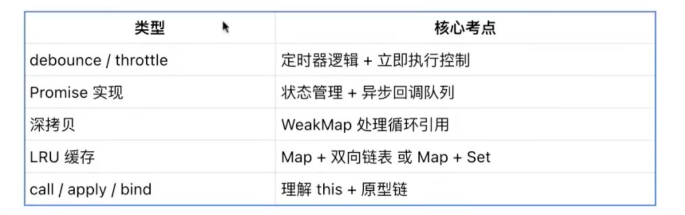

# 面试准备流程

- 第一层：JavaScript（高频必考）
    - 核心考点：JS语言本身的运行机制和特性
    - 核心知识点：
        - 执行机制：EventLoop、宏任务/微任务、调用栈、任务队列
        - 作用域与闭包：词法作用域、执行上下文、闭包与内存泄露
        - this指向：绑定原则、箭头函数、显示绑定方法
        - 原型与继承：原型链、构造函数、calss继承、组合继承
    - 典型面试问题
        - 讲一下EventLoop的执行过程，setTimeout、Promise、async/await的执行顺序是什么？
        - 闭包在实际项目中有哪些应用场景？可能会造成什么问题？
        - 为什么在React中this绑定很重要？有哪些绑定方式？

- 第二层：浏览器原理（重点难点）
    - ​核心考点​​：浏览器渲染引擎和网络通信机制
    - ​核心知识点​​：
        - ​渲染流程​​：DOM树构建、CSSOM树、渲染树、布局、绘制
        ​- ​性能优化​​：回流重绘、合成层、懒加载、预加载、防抖节流
        - ​DOM与事件​​：事件委托、事件冒泡、性能优化技巧
        - ​​网络通信​​：HTTP状态码、缓存机制、跨域CORS、TCP连接
    - ​典型面试问题​​：
        - “从输入URL到页面展示，中间经历了哪些过程？”
        - “回流和重绘的区别是什么？如何优化？”
        - “浏览器的缓存策略有哪些？强缓存和协商缓存的区别？”

- 第三层：框架与状态管理（应用层）
    - ​核心考点​​：现代前端框架的设计思想和实现原理
    - ​核心知识点​​：
        - React：虚拟DOM、Diff算法、Hooks机制、Fiber架构
        - Vue：响应式系统、模板编译、组件化、Composition API
        - 状态管理：Redux/Vuex原理、中间件、数据流设计
        - 路由管理：前端路由原理、懒加载、路由守卫
    - ​典型面试问题​​：
        - "React的Diff算法是如何工作的？key的作用是什么？"
        - "Vue的响应式系统是怎么实现的？Proxy相比Object.defineProperty有什么优势？"
        - "为什么需要状态管理？Redux的中间件是如何工作的？"

- 第四层：工程化与安全（实践层）
    - 核心考点：现代前端开发工具链和安全防护
    - 核心知识点：
        - 构建工具：Webpack/Vite原理、Tree Shaking、代码分割
        - 工程化：模块化、包管理、CI/CD、代码质量
        - Web安全：XSS攻击防御、CSRF防护、CSP策略、输入校验
        - 性能监控：前端监控、错误捕获、性能指标
    - 典型面试问题：
        - "Webpack的打包原理是什么？Tree Shaking是如何实现的？"
        - "项目中如何防范XSS攻击？有哪些具体的防护措施？"
        - "你们的前端监控是如何实现的？如何收集和上报错误信息？"

- 常考函数题

- 高频场景题
    >**“你能手写一个 xxx 吗？”这类问题背后，考的是抽象建模能力与技术表达能力。**
    - 实现发布订阅模式（EventEmitter）
    - 限制异步并发（如 limitConcurrent）
    - 手写 useDebounce / useThrottle hook
    - 模拟实现一个简易状态管理器（如 mini Redux）

- 组件设计题
    >组件类题目考察你的封装能力 + 状态管理 + 可扩展性。

    - 典型题目包括：
        - 实现一个受控/非受控的 Input 组件
        - 自定义 Modal，支持遮罩关闭、动画、插槽
        - 手写 Tabs / Collapse / Tooltip 等 UI 基础组件
        - 实现一个虚拟滚动列表（如 VirtualList）

- 如何准备？
    - 理解原理 → 举例实践 → 拓展变化
    - 带注释书写：让代码清晰易懂
    - 关注边界处理：如错误处理、loading 状态
    - 展示“表达能力”：边写边说，结构清晰，逻辑自洽
