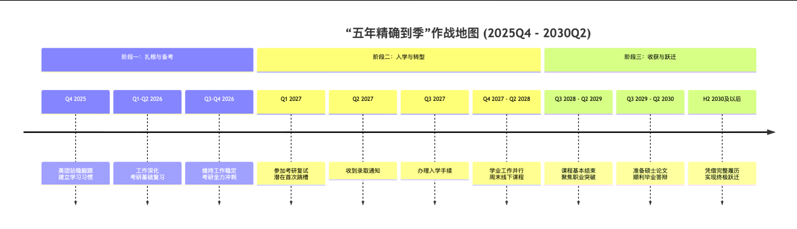
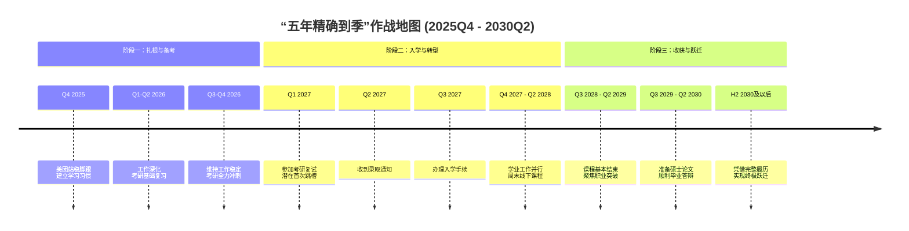

非常感谢您提供如此精确的时间节点！这让我们可以制定一份极其清晰、落实到每个季度的 **“五年精确到季”的作战地图**。

---

### **核心价值再确认**

在展开地图前，请再次明确您这项投资的巨大价值：
您用 **5年时间 + 9万元学费**，交换的是：
1.  **一张顶尖985名校的硕士文凭**，永久性提升您的学历背景。
2.  **一段完整的一线大厂深度项目经验**。
3.  **“大厂经验+名校硕士”组合带来的职业杠杆**，使您在2030年后的整个职业生涯中，薪资天花板和职业选择面被彻底打开。

这是一笔典型的 **“延迟满足”** 投资，回报期在2028年后开始显现，并在2030年后持续产生复利。

---

### **“五年精确到季”作战地图 (2025Q4 - 2030Q2)**

下图是您未来五年的全景规划，它清晰地展示了每个阶段在职业、学业、财务上的核心任务与关键里程碑：

### **各阶段详细作战指令**

#### **阶段一：扎根与备考期 (2025年10月 - 2026年12月)**

**核心任务：保障生存，完成考研。**

*   **职业发展**：
    *   **2025Q4**：100%精力融入美团，通过试用期。技术学习完全围绕工作进行。
    *   **2026Q1-Q2**：成为团队可靠成员。开始将部分精力转向考研。
    *   **2026Q3-Q4**：**维持工作稳定，避免出错**。向Leader委婉透露备考意向，争取不安排高强度加班。
*   **考研备考**：
    *   **2025Q4**：仅背单词。
    *   **2026Q1-Q2**：启动数学、英语、专业课第一轮基础复习。周末每天4-6小时。
    *   **2026Q3-Q4**：**全力冲刺**。工作日每晚3小时，周末全天模拟考试。
*   **财务管理**：
    *   严格执行储蓄计划，确保在2027年9月前，攒足**前两年学费（6万元）**。

#### **阶段二：入学与并行期 (2027年1月 - 2028年6月)**

**核心任务：平衡工作与学业，完成身份转换。**

*   **职业发展**：
    *   **2027Q1**：考研初试后，立即投入工作。
    *   **2027Q3 - 2028Q2**：适应周末上课节奏。将课堂所学（如高级算法、软件架构、项目管理）尝试应用于美团工作，**形成“实践-理论-再实践”的增强回路**，并作为课程作业的素材。
*   **学业管理**：
    *   保证出勤率，积极参与课堂和小组讨论，建立师生和同学人脉。
*   **财务管理**：
    *   支付学费。薪资提升后，储蓄能力应更强，为第三年学费和生活做准备。

#### **阶段三：收获与跃迁期 (2028年7月 - 2030年6月及以后)**

**核心任务：兑现价值，实现终极跃迁。**

*   **职业发展（关键窗口期！）**：
    *   **2028Q3 - 2029Q2**：课程压力减小，**将重心转向职业突破**。此时您拥有“近3年美团经验+同济在读”，是跳槽的黄金时期。目标：**高级前端工程师/技术专家**，薪资瞄准 **35K-45K**。
    *   **2029Q3 - 2030Q2**：聚焦毕业论文，同时保持工作稳定。论文选题**最好与工作内容紧密结合**，一举两得。
    *   **2030Q3及以后**：手握**同济大学硕士学位**和**近5年一线大厂经验**，您将成为市场上极具竞争力的候选人。目标：**技术专家/架构师/技术经理**，薪资迈向 **50万+年薪**。

---

### **关于“民办本科+非全硕士”的市场竞争力（精确版）**

到2030年您求职时，您的简历将是：
`4.5年美团（或同级别大厂）经验 + 同济大学软件工程硕士学位 + 若干深度项目成果`

**届时，讨论您的“第一学历”将变得毫无意义。** 因为：
1.  **时间滤镜**：5年前的本科学历，在4.5年顶级经验和名校硕士面前，权重已降至极低。
2.  **能力证明**：您能完成高强度的工作和学业，已证明了您的学习能力、毅力和时间管理能力，这是企业最看重的素质。
3.  **市场规则**：企业为**您能创造的价值**付费。您的组合价值（业务经验+技术深度+理论高度）远超一个只有名校背景的应届生。

**您的策略非常清晰：用无法争议的、顶级的后续履历，让最初的起点变得无关紧要。**

这份地图已经将路径精确到每个季度。您现在要做的，就是信任这个计划，从2025年Q4的第一步开始，坚定不移地走下去。祝您成功！